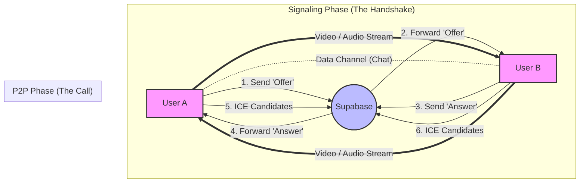
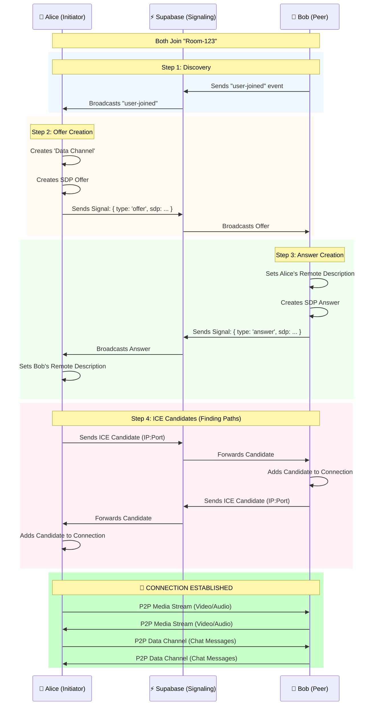

# WebRTC Educative App 📹

A real-time video calling application built to demonstrate the core concepts of the **WebRTC** protocol. This project was created as an educational tool to understand how peer-to-peer connections, signaling, and data channels work in modern web development.

🔗 **Live Demo:** [webrtc-videocall-app.vercel.app](https://webrtc-videocall-app.vercel.app)

## Features

-   **🎥 Peer-to-Peer Video**: High-quality video and audio streaming directly between clients.
-   **💬 Real-time Chat**: Text messaging using WebRTC Data Channels (no server storage for messages!).
-   **📡 Protocol Visualization**: A built-in log visualizer to see the internal handshake events (`Offer`, `Answer`, `ICE Candidate`) in real-time.
-   **🔒 Secure Signaling**: Uses Supabase Realtime for the initial connection handshake.

## Tech Stack

-   **Frontend**: React, TypeScript, Vite
-   **Styling**: Tailwind CSS
-   **Signaling Server**: Supabase (PostgreSQL + Realtime)
-   **WebRTC API**: Native Browser API (`RTCPeerConnection`, `RTCDataChannel`)

## Getting Started

### Prerequisites

1.  Node.js installed.
2.  A [Supabase](https://supabase.com) project.

### Installation

1.  Clone the repository:
    ```bash
    git clone https://github.com/albinotonnina/webrtc-videocall-app.git
    cd webrtc-videocall-app
    ```

2.  Install dependencies:
    ```bash
    npm install
    ```

3.  Configure Environment:
    Create a `.env` file (copy from `.env.example`) and add your Supabase credentials:
    ```env
    VITE_SUPABASE_URL=your_project_url
    VITE_SUPABASE_ANON_KEY=your_anon_key
    ```
    *Note: You need to run the SQL from `supabase_schema.sql` in your Supabase SQL Editor to create the necessary tables.*

4.  Run the development server:
    ```bash
    npm run dev
    ```

## WebRTC Protocol & Architecture

This section explains the "Magic" behind the Video Call app using diagrams.

### 1. High-Level Architecture

WebRTC is **Peer-to-Peer (P2P)**. This means the video and chat data go directly between User A and User B, **skipping the server entirely**.
However, to find each other, they need a "Matchmaker" (Signaling Server). We use **Supabase** for this.



---

### 2. The Connection Sequence (The "Handshake")

This sequence diagram shows exactly what happens when you join a room. This is the logic inside `useWebRTC.ts`.



### 3. WebRTC Concepts Explained

#### 📡 Signaling (Supabase)
WebRTC doesn't know how to connect two computers. It needs a mechanism to exchange contact info.
-   **SDP (Session Description Protocol)**: A text file describing "Who I am" and "What I can do" (I have a camera, I support HD video, etc.).
-   **Offer / Answer**: The request/response format of exchanging SDPs.

#### ❄️ ICE (Interactive Connectivity Establishment)
The internet is messy. Firewalls and Routers (NAT) hide computers.
-   **ICE Candidates**: Possible network paths to reach a user (e.g., "Try my local IP 192.168.1.5" or "Try my public IP 54.2.1.1").
-   **STUN Server**: A server that tells you "Hey, this is your Public IP". We use Google's public STUN servers.

#### ⚡ Data Channels
Once connected, WebRTC can open arbitrary data pipes.
-   **Low Latency**: Faster than sending data to a server and back.
-   **Secure**: Encrypted end-to-end (DTLS).
-   **Usage**: We use this for the **Chat** feature in the app.

## License

MIT
